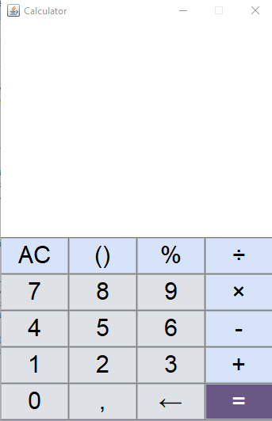

# Swing Calculator
A small calculator built with **Java Swing**.  
It mimics a mobile-style layout and coloring.

## Features
- Chain operations (e.g., `3 + 3 + 3 + …`) — the calculation happens when you press **`=`**
- **Left-to-right** evaluation (no operator precedence yet)
- Decimal **comma** (`,`) input
- `%` applies to the **current number** being typed
- `()` are visual only for now (not evaluated)
- Top row and right column styled light blue, digit keys light grey, `=` purple

## Requirements
- Java **8+**
- (Optional) IntelliJ IDEA (Community or Ultimate)

## Run in IntelliJ IDEA
1. **Open** the project folder in IntelliJ.
2. Make sure **Project SDK** is set (File → Project Structure → Project).
3. If you have a `src` folder, **Mark Directory as → Sources Root**.
4. Ensure the `Calculator` class has a `main` method:
   ```java
   public static void main(String[] args) {
        Calculator calculator= new Calculator();
   }

## Notes / Behavior

- When you press multiple operators in a row, the last one replaces the previous operator (e.g., 3 + then × shows 3 × ).

- If the display is empty and you press -, it starts a negative number.

- Backspace erases one character; AC clears everything.

- Parentheses are displayed but ignored by the evaluator (roadmap item).
## UI Palette
- Top row & right column: light blue `#DBE5F7`
- Digits/others: light grey `#E8EBEE`
- `=:` purple `#6A5884`
- Text: dark grey / white accordingly


## Screenshot

